<!-- Generated by game/build-readme.mjs. Do not hand-edit the panel block.
     The sky is one gradient sliced across the panels, so a stray newline
     between two  tags becomes a text node and a visible white seam. -->

<picture><source media="(prefers-color-scheme: dark)" srcset="./assets/header-dark.svg"></picture><picture><source media="(prefers-color-scheme: dark)" srcset="./assets/page/intro-dark.de.svg"></picture><picture><source media="(prefers-color-scheme: dark)" srcset="./assets/page/stats-dark.de.svg">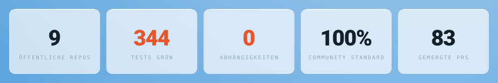</picture><picture><source media="(prefers-color-scheme: dark)" srcset="./assets/page/try-dark.de.svg"></picture><a href="https://arsalanrc.github.io/chess-engine/"><picture><source media="(prefers-color-scheme: dark)" srcset="./assets/page/try-0-dark.de.svg">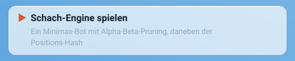</picture></a><a href="https://arsalanrc.github.io/integration-patterns/"><picture><source media="(prefers-color-scheme: dark)" srcset="./assets/page/try-1-dark.de.svg">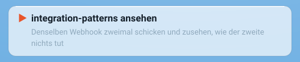</picture></a><a href="https://arsalanrc.github.io/recon/"><picture><source media="(prefers-color-scheme: dark)" srcset="./assets/page/try-2-dark.de.svg">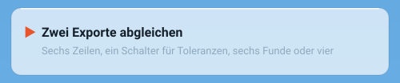</picture></a><a href="https://arsalanrc.github.io/pg-outbox/"><picture><source media="(prefers-color-scheme: dark)" srcset="./assets/page/try-3-dark.de.svg"></picture></a><a href="https://arsalanrc.github.io/stylo/"><picture><source media="(prefers-color-scheme: dark)" srcset="./assets/page/try-4-dark.de.svg"></picture></a><a href="https://arsalanrc.github.io/slotting/"><picture><source media="(prefers-color-scheme: dark)" srcset="./assets/page/try-5-dark.de.svg"></picture></a><a href="https://arsalanrc.github.io/rally/"><picture><source media="(prefers-color-scheme: dark)" srcset="./assets/page/try-6-dark.de.svg">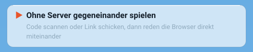</picture></a><a href="https://arsalanrc.github.io/plinth/"><picture><source media="(prefers-color-scheme: dark)" srcset="./assets/page/try-7-dark.de.svg">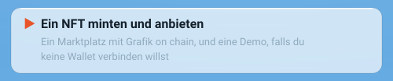</picture></a><picture><source media="(prefers-color-scheme: dark)" srcset="./assets/page/work-dark.de.svg"></picture><a href="https://arsalanrc.github.io/arena-lounge/"><picture><source media="(prefers-color-scheme: dark)" srcset="./assets/page/card-lounge-dark.de.svg">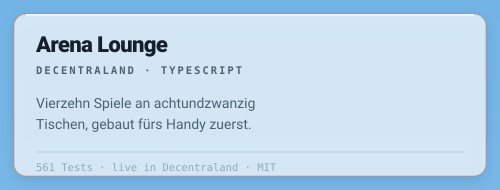</picture></a><a href="https://github.com/ArsalanRC/plinth"><picture><source media="(prefers-color-scheme: dark)" srcset="./assets/page/card-plinth-dark.de.svg">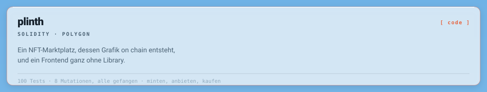</picture></a><a href="https://github.com/ArsalanRC/slotting"><picture><source media="(prefers-color-scheme: dark)" srcset="./assets/page/card-slotting-dark.de.svg">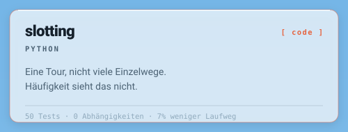</picture></a><a href="https://github.com/ArsalanRC/stylo"><picture><source media="(prefers-color-scheme: dark)" srcset="./assets/page/card-stylo-dark.de.svg">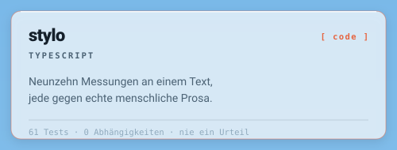</picture></a><a href="https://github.com/ArsalanRC/pg-outbox"><picture><source media="(prefers-color-scheme: dark)" srcset="./assets/page/card-outbox-dark.de.svg">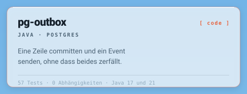</picture></a><a href="https://github.com/ArsalanRC/recon"><picture><source media="(prefers-color-scheme: dark)" srcset="./assets/page/card-recon-dark.de.svg">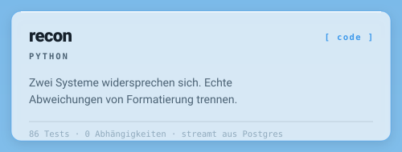</picture></a><a href="https://github.com/ArsalanRC/chess-engine"><picture><source media="(prefers-color-scheme: dark)" srcset="./assets/page/card-chess-dark.de.svg">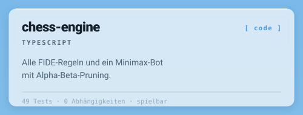</picture></a><a href="https://github.com/ArsalanRC/integration-patterns"><picture><source media="(prefers-color-scheme: dark)" srcset="./assets/page/card-patterns-dark.de.svg">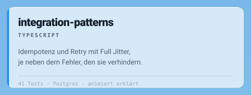</picture></a><a href="https://github.com/ArsalanRC/rally"><picture><source media="(prefers-color-scheme: dark)" srcset="./assets/page/card-rally-dark.de.svg">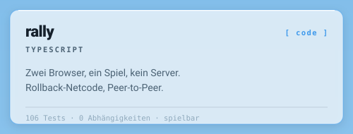</picture></a><a href="#game-arena"><picture><source media="(prefers-color-scheme: dark)" srcset="./assets/page/card-arena-dark.de.svg">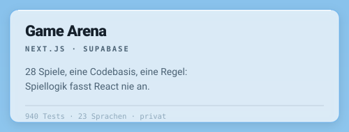</picture></a><picture><source media="(prefers-color-scheme: dark)" srcset="./assets/page/how-dark.de.svg"></picture><picture><source media="(prefers-color-scheme: dark)" srcset="./assets/page/stack-dark.de.svg">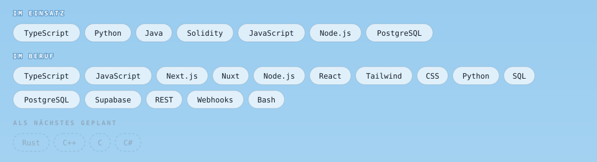</picture><picture><source media="(prefers-color-scheme: dark)" srcset="./assets/page/foot-dark.de.svg">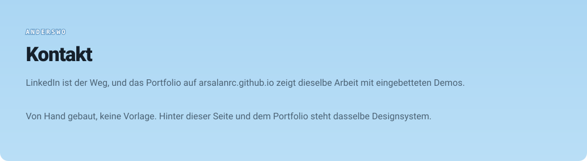</picture><a href="https://arsalanrc.github.io"><picture><source media="(prefers-color-scheme: dark)" srcset="./assets/page/link-portfolio-dark.de.svg"></picture></a><a href="https://www.linkedin.com/in/muhammad-arsalan-khadim-b87550259/"><picture><source media="(prefers-color-scheme: dark)" srcset="./assets/page/link-linkedin-dark.de.svg"></picture></a><a href="https://github.com/ArsalanRC"><picture><source media="(prefers-color-scheme: dark)" srcset="./assets/page/link-github-dark.de.svg"></picture></a>

**Deutsch** · [English](./README.md) &nbsp;·&nbsp; [Portfolio](https://arsalanrc.github.io) &nbsp;·&nbsp; [LinkedIn](https://www.linkedin.com/in/muhammad-arsalan-khadim-b87550259/)
