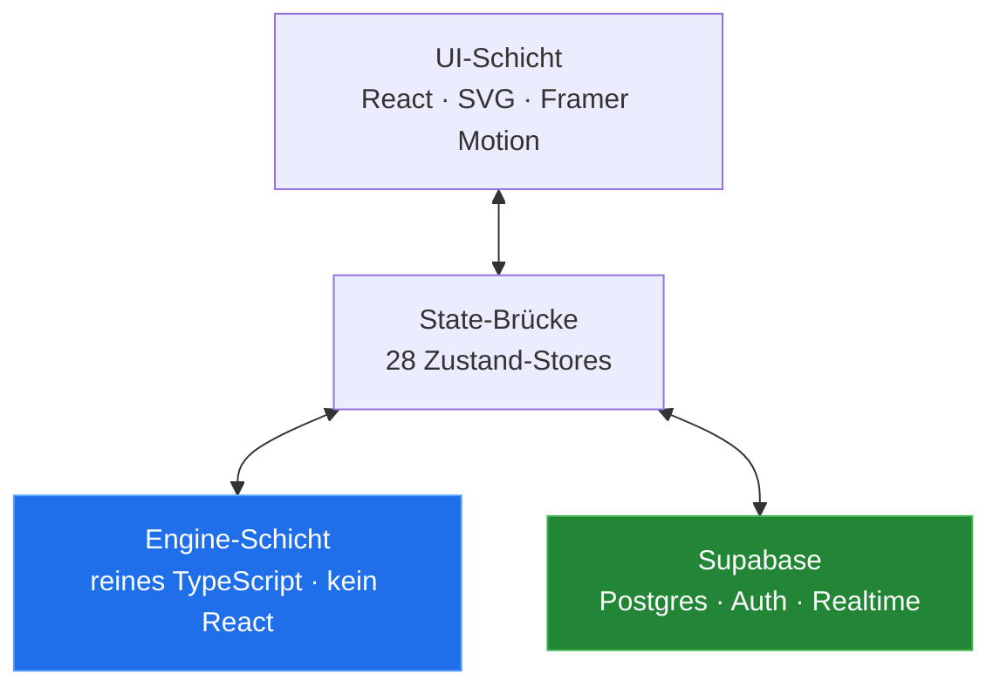

<picture>
  <source media="(prefers-color-scheme: dark)" srcset="./assets/header-dark.svg">
  
</picture>

[English](./README.md) · **Deutsch**

---

**Softwarearchitekt und Full-Stack-Engineer.** Aktuell Software Development Manager, das heißt: Ich verantworte die Systeme und die Roadmap und schreibe nebenbei einen ordentlichen Teil der Commits selbst.

Der Großteil meiner Arbeitszeit geht in die unglamouröse Hälfte der Softwareentwicklung: Systeme, die nie dafür gebaut wurden, zuverlässig miteinander reden zu lassen. Jeden Tag, ohne dass es jemandem auffällt. Lagerverwaltung, ERP-Integrationen, Logistik-APIs. Code, bei dem ein stiller Fehler jemanden eine Sendung kostet.

Die Repos hier sind die andere Hälfte. Dort darf ich etwas von Grund auf entwerfen und die Architektur ernst nehmen.

---

## Direkt ausprobieren

Keine Installation, keine Anmeldung, nichts herunterzuladen. Beides läuft direkt im Browser.

| | |
|---|---|
| ▶︎ **[Gegen meine Schach-Engine spielen](https://arsalanrc.github.io/chess-engine/)** | Ein Minimax-Bot mit Alpha-Beta-Pruning, und daneben die Innenansicht der Engine in Echtzeit |
| ▶︎ **[integration-patterns erklärt](https://arsalanrc.github.io/integration-patterns/)** | Animiert Schritt für Schritt: ein doppelter Webhook wird abgefangen, ein Retry-Sturm wirft einen Dienst um |

---

## Ausgewählte Projekte

| Projekt | Worum es geht | Stack |
|---|---|---|
| [**Game Arena**](#game-arena) | 28 spielbare Spiele auf einer Plattform, gemeinsame Engine-Architektur, Online-Mehrspieler, 23 Sprachen | Next.js 14 · TypeScript · Supabase |
| [**`chess-engine`**](https://github.com/ArsalanRC/chess-engine) · [spielen](https://arsalanrc.github.io/chess-engine/) | Eigenständige Engine: vollständige FIDE-Regeln, Minimax mit Alpha-Beta-Pruning, keine Abhängigkeiten | TypeScript |
| [**`integration-patterns`**](https://github.com/ArsalanRC/integration-patterns) · [erklärt](https://arsalanrc.github.io/integration-patterns/) | Die Logik, die Integrationen zwischen Systemen korrekt hält: Idempotenz, Retry mit Backoff und Jitter, jeweils mit dem Fehlerfall, den sie verhindert | TypeScript · Postgres |
| **`stylo`** | Stylometrischer Textabgleich: rund 20 Merkmale gegen eine echte Korpusverteilung gemessen | TypeScript · MCP |

---

## Game Arena

Eine Spieleplattform, gebaut um herauszufinden, wie weit sich eine strikte Architekturgrenze treiben lässt. 28 Spiele, eine Codebasis, **940 Tests**.

Eine Regel hat alles andere geprägt: Spiellogik fasst React niemals an. Jede Engine ist reines TypeScript, also deterministische Funktionen, keine Seiteneffekte, keine Framework-Importe. Der State liegt in Zustand-Stores, die ausschließlich als Brücke dienen, und die UI-Schicht rendert nur.

Diese Grenze hat sich immer wieder ausgezahlt. Engines sind trivial testbar, weil nichts gerendert, nichts gemockt und kein DOM aufgebaut werden muss. Dieselbe Schach-Engine läuft im Browser, im Test-Runner und in der Suchschleife eines Bots, ohne eine einzige Änderung. Und das Beste: Ein Bug liegt immer auf genau einer Seite der Grenze.

<b>Was drinsteckt</b>

 

**Spiele.** Schach, Dame, Backgammon, Ludo, Reversi, Vier gewinnt, Poker (Heads-up Hold'em), Sea Strike, Estate Tycoon mit 6 Spielbrett-Varianten, Sudoku, Solitär, Snake, Tetris- und Pac-Man-Varianten und mehr. Jeweils mit Bot-Gegnern in drei Stufen sowie lokalem Wechselspiel.

**Bots.** Die KI passt zum Spiel statt ein einziger Universallöser zu sein: Minimax mit Alpha-Beta-Pruning für Schach, Dame und Vier gewinnt; Positions- und Mobilitätsheuristiken für Reversi; Pot-Odds-Bewertung für Poker; Gedächtnis-Tracking für Memory.

**Online-Mehrspieler.** Auf Supabase Realtime, jeder Zug serverseitig validiert. Bei Sea Strike wird der Spielfeldzustand über `SECURITY DEFINER`-Funktionen partitioniert, sodass keiner der beiden Spieler die Schiffsaufstellung des Gegners aus der Datenbank lesen kann, auch nicht mit gültiger Session.

**Sicherheit.** Row Level Security auf jeder Tabelle, keinerlei anonymer Zugriff, Rechteänderungen nur über die Service-Rolle.

**Internationalisierung.** 23 Sprachen, davon drei von rechts nach links, mit sprachbewusstem Routing.

**Responsive.** Ein Layoutsystem für Smartphone, Tablet, Desktop und TV, inklusive Safe-Area-Handling für Geräte mit Notch.

 

*Der Quellcode ist privat. Über die Architektur spreche ich gern im Gespräch.*

---

## Wie ich an Software herangehe

**Grenzen vor Features.** Die Schichtaufteilung ist die eine Entscheidung, die sich später nicht mehr billig zurücknehmen lässt. Also verdient sie die Zeit. Alles andere ist verhandelbar.

**Reinheit dort, wo sie zählt.** Fachlogik ohne Framework-Abhängigkeit lässt sich wirklich testen, wiederverwenden und durchdenken. Seiteneffekte gehören an den Rand, die Mitte bleibt sauber.

**Sicher by default, nicht durch Review.** RLS ist aktiv, bevor die Tabelle Zeilen hat, und Policies verweigern im Zweifel. Ein Recht, das nie vergeben wurde, kann auch nicht das sein, das leakt.

**Aufschreiben.** Zu jedem Projekt, das ich verantworte, gehören Architekturdokumente und Konventionen, die ein neuer Entwickler (oder ein LLM) kalt lesen und innerhalb einer Stunde nutzen kann. Je mehr Leute den Code anfassen, desto wichtiger wird das.

---

## Stack

**Sprachen** · TypeScript · JavaScript · Python · SQL · Bash

**Frontend** · React · Next.js (App Router) · Tailwind · Zustand · Framer Motion · SVG

**Backend und Daten** · Node.js · PostgreSQL · Supabase · REST · Webhooks

**Praxis** · Systemarchitektur · Systemintegration · Testgetriebene Entwicklung · CI/CD · Technische Führung

---

## Kontakt

- **LinkedIn** · [muhammad-arsalan-khadim](https://www.linkedin.com/in/muhammad-arsalan-khadim-b87550259/)
- **E-Mail** · arsalanrc200014@gmail.com
