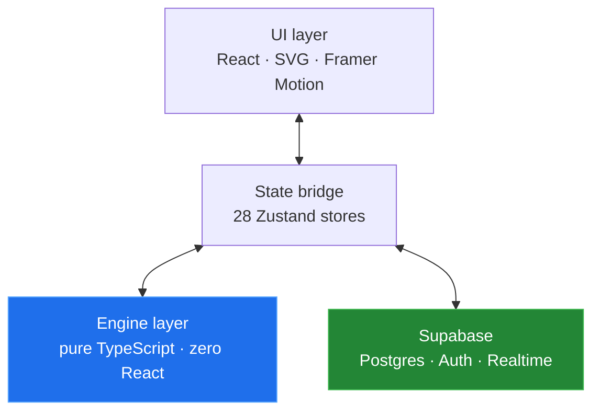

# Arsalan Khadim

**Software architect and full-stack engineer.** Currently Software Development Manager, which means I own the systems and the roadmap along with a fair share of the commits.

Most of my working life goes on the unglamorous half of software: making systems that were never designed to talk to each other exchange data reliably, every day, without anyone noticing. Warehouse management, ERP integrations, logistics APIs. The kind of code where a silent failure costs someone a shipment.

The repos here are the other half, where I get to design something from scratch and take the architecture seriously.

### ▶︎ [Play my chess engine in your browser](https://arsalanrc.github.io/chess-engine/)

No install, no sign-up, nothing to download. It opens and you play. The board sits next to a live readout of what the engine is thinking: its evaluation, the legal move count, and the position hash it uses to detect repetition.

---

## Selected work

| Project | What it is | Stack |
|---|---|---|
| [**Game Arena**](#game-arena) | 28 playable games on one platform, sharing an engine architecture, with online multiplayer and 23 languages | Next.js 14 · TypeScript · Supabase |
| [**`chess-engine`**](https://github.com/ArsalanRC/chess-engine) ·  [play it](https://arsalanrc.github.io/chess-engine/) | Standalone chess engine: complete FIDE rules, minimax with alpha-beta pruning, zero dependencies | TypeScript |
| **`stylo`** | Stylometric text fingerprinting, measuring ~20 features against a real corpus distribution | TypeScript · MCP |
| **`integration-patterns`** | Reference implementations for idempotent webhooks, retries, dead-letter queues, reconciliation | TypeScript · Postgres |

> This profile is still being built out. Repos appear once they are finished properly, rather than dumped here half-done.

---

## Game Arena

A game platform I built to find out how far a strict architectural boundary could be pushed. 28 games, one codebase, **940 tests**.

One rule shaped everything else: game logic never touches React. Every engine is pure TypeScript, meaning deterministic functions, no side effects and no framework imports. State lives in Zustand stores that act purely as a bridge, and the UI layer only renders.

That boundary paid for itself repeatedly. Engines are trivially testable because there is no rendering, no mocking and no DOM to stand up first. The same chess engine runs in a browser, in a test runner, and inside a bot's search loop without a single change. Best of all, a bug is always on exactly one side of the line.

<b>What's inside</b>

 

**Games.** Chess, Checkers, Backgammon, Ludo, Reversi, Connect Four, Poker (heads-up Hold'em), Sea Strike, Estate Tycoon with 6 board variants, Sudoku, Solitaire, Snake, Tetris- and Pac-Man-likes, and more. Each ships with bot opponents at three difficulties plus local pass-and-play.

**Bots.** The AI is matched to the game rather than being one generic solver: minimax with alpha-beta pruning for chess, checkers and Connect Four; positional and mobility heuristics for Reversi; pot-odds evaluation for poker; memory tracking for Match Pairs.

**Online multiplayer.** Built on Supabase Realtime, with every move validated server-side. Sea Strike partitions board state through `SECURITY DEFINER` functions, so neither player can read the opponent's ship placement out of the database even with a valid session.

**Security.** Row-level security on every table, anonymous access to nothing, and privilege changes gated to the service role.

**Internationalisation.** 23 languages including three right-to-left, with locale-aware routing.

**Responsive.** One layout system covering phone, tablet, desktop and TV, with safe-area handling for notched devices.

 

*Source is private. Happy to walk through the architecture in a conversation.*

---

## How I think about building

**Boundaries before features.** The layer split is the one decision you cannot cheaply undo later, so it deserves the time. Everything else is negotiable.

**Purity where it counts.** Business logic that depends on no framework can actually be tested, reused and reasoned about. Push side effects out to the edges and keep the middle honest.

**Secure by default, not by review.** RLS enabled before the table has rows, and deny-by-default policies throughout. A permission you never granted cannot be the one that leaks.

**Write it down.** Every project I own carries architecture docs and conventions that a new engineer (or an LLM) can read cold and be useful within the hour. The more people touch the code, the more this matters.

---

## Stack

**Languages** · TypeScript · JavaScript · Python · SQL · Bash

**Frontend** · React · Next.js (App Router) · Tailwind · Zustand · Framer Motion · SVG

**Backend and data** · Node.js · PostgreSQL · Supabase · REST · Webhooks

**Practice** · System architecture · Systems integration · Test-driven development · CI/CD · Technical leadership

---

## Elsewhere

- **LinkedIn** · [muhammad-arsalan-khadim](https://www.linkedin.com/in/muhammad-arsalan-khadim-b87550259/)
- **Email** · arsalanrc200014@gmail.com
