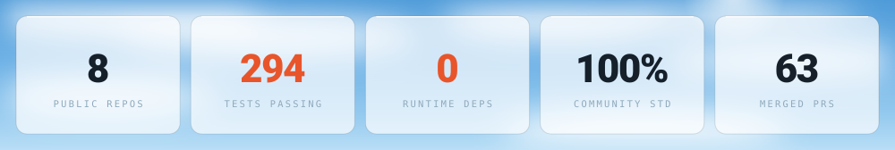
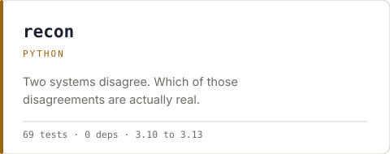
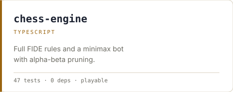
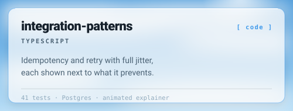
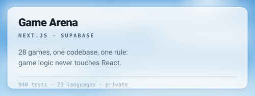
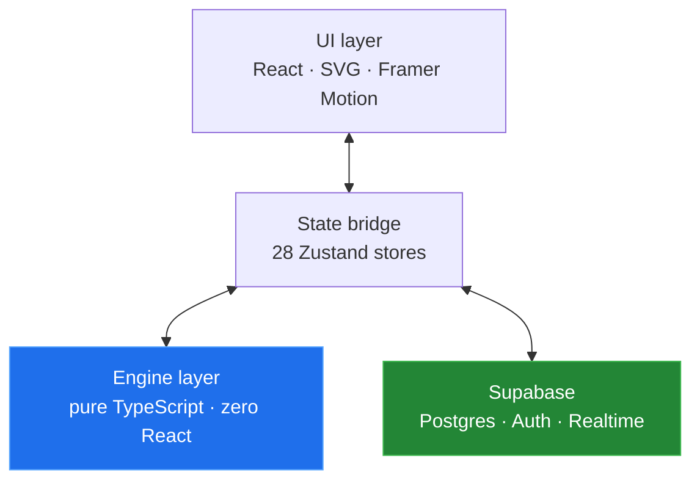
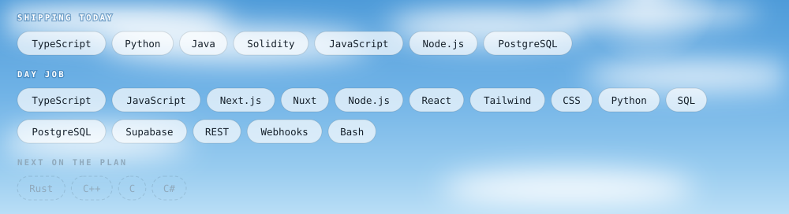

<picture>
  <source media="(prefers-color-scheme: dark)" srcset="./assets/header-dark.svg">
  
</picture>

<a href="https://github.com/ArsalanRC">
  <picture>
    <source media="(prefers-color-scheme: dark)" srcset="./assets/badge-github-dark.svg">
    
  </picture>
</a>
<a href="https://www.linkedin.com/in/muhammad-arsalan-khadim-b87550259/">
  <picture>
    <source media="(prefers-color-scheme: dark)" srcset="./assets/badge-linkedin-dark.svg">
    
  </picture>
</a>

**English** · [Deutsch](./README.de.md)

---

**Software architect and full-stack engineer.** Currently Software Development Manager, which means I own the systems and the roadmap along with a fair share of the commits.

Most of my working life goes on the unglamorous half of software: making systems that were never designed to talk to each other exchange data reliably, every day, without anyone noticing. Warehouse management, ERP integrations, logistics APIs. The kind of code where a silent failure costs someone a shipment.

The repos here are the other half, where I get to design something from scratch and take the architecture seriously.

<picture>
  <source media="(prefers-color-scheme: dark)" srcset="./assets/components/stats-dark.svg">
  
</picture>

---

---

## A puzzle, since my chess engine was going spare

<!-- The board is an image and the answers are `
` blocks. That is real
     interactivity with no JavaScript, no navigation and nothing left behind.
     An earlier version made every square a link opening a pre-filled issue: it
     worked, but a visitor clicking a pawn landed on a bug-report form with no
     warning, and every move littered this repo's issue tracker. A bad trade
     for a novelty. -->

<!-- PUZZLE:START -->

**White to play. Mate in one.** Pick a move to see whether it works.

<code>Ra1-a8</code> &nbsp; rook to a8

**Correct. Checkmate.** The black king is walled in by its own pawns on f7, g7 and h7, so a rook arriving on the back rank ends it immediately. Nothing blocks, nothing captures the rook, and the king has no square.

<code>Bc4xb5</code> &nbsp; bishop takes on b5

**Wins material, misses the win.** Black gets 8 legal moves and the game carries on. Taking a free piece is usually right, which is exactly why it is tempting, and exactly why it is wrong here.

<code>Bc4xf7</code> &nbsp; bishop takes on f7

**Check, but not mate.** Black has 3 legal replies, so the attack does not finish. Giving check is not the same as ending the game, which is the whole point of the puzzle.

<!-- PUZZLE:END -->

Every answer above was verified against [`chess-engine`](https://github.com/ArsalanRC/chess-engine)
rather than written by hand, so the puzzle cannot claim something the engine disagrees with.
It rejected two unsound drafts before this one.

**Want a real game?** [Play the engine in your browser](https://arsalanrc.github.io/chess-engine/):
it answers instantly, with no forms involved.

---

## Portfolio

### [arsalanrc.github.io](https://arsalanrc.github.io)

Everything in one place, with the projects shown in a 3D scene you can steer with your mouse. English and German, light and dark.

---

## Try something of mine, right now

No install, no sign-up, nothing to download. Both of these open and run in your browser.

| | |
|---|---|
| ▶︎ **[Play my chess engine](https://arsalanrc.github.io/chess-engine/)** | A minimax bot with alpha-beta pruning, and the engine's internal state on display beside the board |
| ▶︎ **[See how integration-patterns works](https://arsalanrc.github.io/integration-patterns/)** | An animated walkthrough: watch a duplicate webhook get absorbed and a retry storm take down a recovering service |
| ▶︎ **[Watch recon reconcile two exports](https://arsalanrc.github.io/recon/)** | Six rows, and a switch that turns tolerances on and off. Same rows, six findings or four |

---

## Selected work

<a href="https://github.com/ArsalanRC/recon">
  <picture>
    <source media="(prefers-color-scheme: dark)" srcset="./assets/components/card-recon-dark.svg">
    
  </picture>
</a>
<a href="https://github.com/ArsalanRC/chess-engine">
  <picture>
    <source media="(prefers-color-scheme: dark)" srcset="./assets/components/card-chess-dark.svg">
    
  </picture>
</a>
<a href="https://github.com/ArsalanRC/integration-patterns">
  <picture>
    <source media="(prefers-color-scheme: dark)" srcset="./assets/components/card-patterns-dark.svg">
    
  </picture>
</a>
<a href="#game-arena">
  <picture>
    <source media="(prefers-color-scheme: dark)" srcset="./assets/components/card-arena-dark.svg">
    
  </picture>
</a>

---

## Game Arena

A game platform I built to find out how far a strict architectural boundary could be pushed. 28 games, one codebase, **940 tests**.

One rule shaped everything else: game logic never touches React. Every engine is pure TypeScript, meaning deterministic functions, no side effects and no framework imports. State lives in Zustand stores that act purely as a bridge, and the UI layer only renders.

That boundary paid for itself repeatedly. Engines are trivially testable because there is no rendering, no mocking and no DOM to stand up first. The same chess engine runs in a browser, in a test runner, and inside a bot's search loop without a single change. Best of all, a bug is always on exactly one side of the line.

<b>What's inside</b>

 

**Games.** Chess, Checkers, Backgammon, Ludo, Reversi, Connect Four, Poker (heads-up Hold'em), Sea Strike, Estate Tycoon with 6 board variants, Sudoku, Solitaire, Snake, Tetris- and Pac-Man-likes, and more. Each ships with bot opponents at three difficulties plus local pass-and-play.

**Bots.** The AI is matched to the game rather than being one generic solver: minimax with alpha-beta pruning for chess, checkers and Connect Four; positional and mobility heuristics for Reversi; pot-odds evaluation for poker; memory tracking for Match Pairs.

**Online multiplayer.** Built on Supabase Realtime, with every move validated server-side. Sea Strike partitions board state through `SECURITY DEFINER` functions, so neither player can read the opponent's ship placement out of the database even with a valid session.

**Security.** Row-level security on every table, anonymous access to nothing, and privilege changes gated to the service role.

**Internationalisation.** 23 languages including three right-to-left, with locale-aware routing.

**Responsive.** One layout system covering phone, tablet, desktop and TV, with safe-area handling for notched devices.

 

*Source is private. Happy to walk through the architecture in a conversation.*

---

## How I think about building

**Boundaries before features.** The layer split is the one decision you cannot cheaply undo later, so it deserves the time. Everything else is negotiable.

**Purity where it counts.** Business logic that depends on no framework can actually be tested, reused and reasoned about. Push side effects out to the edges and keep the middle honest.

**Secure by default, not by review.** RLS enabled before the table has rows, and deny-by-default policies throughout. A permission you never granted cannot be the one that leaks.

**Write it down.** Every project I own carries architecture docs and conventions that a new engineer (or an LLM) can read cold and be useful within the hour. The more people touch the code, the more this matters.

---

## Stack

<picture>
  <source media="(prefers-color-scheme: dark)" srcset="./assets/components/stack-dark.svg">
  
</picture>

---

## Elsewhere

- **LinkedIn** · [muhammad-arsalan-khadim](https://www.linkedin.com/in/muhammad-arsalan-khadim-b87550259/)
