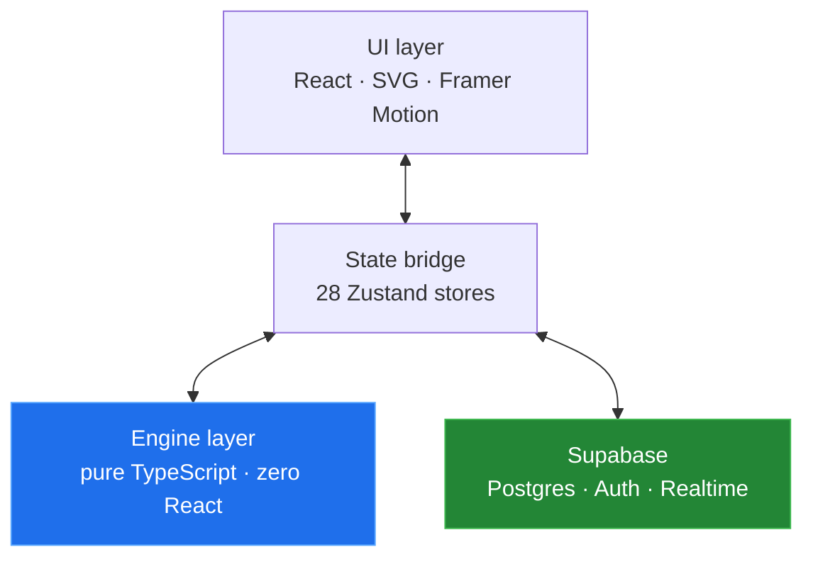

# Arsalan Khadim

**Software architect and full-stack engineer.** Currently Software Development Manager — I own the systems, the roadmap, and a fair share of the commits.

Most of my working life is spent on the unglamorous half of software: making systems that were never designed to talk to each other exchange data reliably, every day, without anyone noticing. Warehouse management, ERP integrations, logistics APIs. The kind of code where a silent failure costs someone a shipment.

The repos here are the other half — where I get to design something from scratch and take the architecture seriously.

---

## Selected work

| Project | What it is | Stack |
|---|---|---|
| [**Game Arena**](#game-arena) | 28 playable games on one platform — shared engine architecture, online multiplayer, 23 languages | Next.js 14 · TypeScript · Supabase |
| **`chess-engine`** | Standalone chess engine: complete FIDE rules, minimax with α–β pruning, zero dependencies | TypeScript |
| **`stylo`** | Stylometric text fingerprinting — measures ~20 features against a real corpus distribution | TypeScript · MCP |
| **`integration-patterns`** | Reference implementations for idempotent webhooks, retries, dead-letter queues, reconciliation | TypeScript · Postgres |

> Work in progress — this profile is being built out. Repos appear as they're finished properly rather than dumped half-done.

---

## Game Arena

A game platform I built to see how far a strict architectural boundary could be pushed. 28 games, one codebase, **940 tests**.

The rule that shaped everything: **game logic never touches React.** Every engine is pure TypeScript — deterministic functions, no side effects, no framework imports. State lives in Zustand stores that act purely as a bridge. The UI layer only renders.

That boundary paid for itself repeatedly. Engines are trivially testable — no rendering, no mocking, no DOM. The same chess engine runs in a browser, in a test runner, and in a bot's search loop with no changes. And a bug is always on exactly one side of the line.

<b>What's inside</b>

 

**Games** — Chess, Checkers, Backgammon, Ludo, Reversi, Connect Four, Poker (heads-up Hold'em), Sea Strike, Estate Tycoon (6 board variants), Sudoku, Solitaire, Snake, Tetris- and Pac-Man-likes, and more. Each with bot opponents at three difficulties, plus local pass-and-play.

**Bots** — the AI is matched to the game, not one generic solver: minimax with α–β pruning for chess, checkers and Connect Four; positional and mobility heuristics for Reversi; pot-odds evaluation for poker; memory-tracking for Match Pairs.

**Online multiplayer** — Supabase Realtime, with moves validated server-side. Sea Strike partitions board state through `SECURITY DEFINER` functions, so neither player can read the opponent's ship placement out of the database even with a valid session.

**Security** — row-level security on every table, anonymous access to nothing, privilege changes gated to the service role.

**Internationalisation** — 23 languages including three right-to-left, with locale-aware routing.

**Responsive** — one layout system across phone, tablet, desktop and TV, with safe-area handling for notched devices.

 

*Source is private. Happy to walk through the architecture in a conversation.*

---

## How I think about building

**Boundaries before features.** The layer split is the decision you cannot cheaply undo later. Everything else is negotiable.

**Purity where it counts.** Business logic that depends on no framework can be tested, reused and reasoned about. Push side effects to the edges and keep the middle honest.

**Secure by default, not by review.** RLS enabled before the table has rows. Deny-by-default policies. A permission you never granted can't be the one that leaks.

**Write it down.** Every project I own carries architecture docs and conventions that a new engineer — or an LLM — can read cold and be useful within the hour. This matters more the more people touch the code.

---

## Stack

**Languages** · TypeScript · JavaScript · Python · SQL · Bash

**Frontend** · React · Next.js (App Router) · Tailwind · Zustand · Framer Motion · SVG

**Backend & data** · Node.js · PostgreSQL · Supabase · REST · Webhooks

**Practice** · System architecture · Systems integration · Test-driven development · CI/CD · Technical leadership

---

## Elsewhere

- **LinkedIn** — *coming soon*
- **Email** — arsalanrc200014@gmail.com
